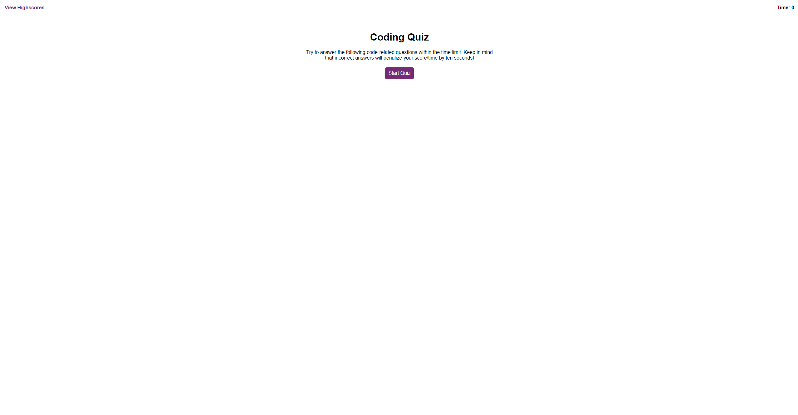
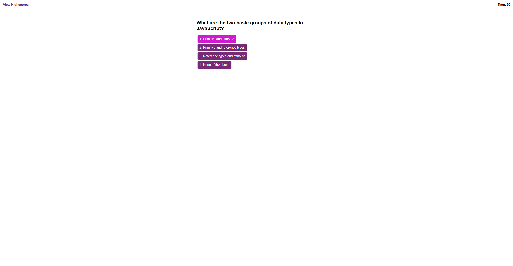
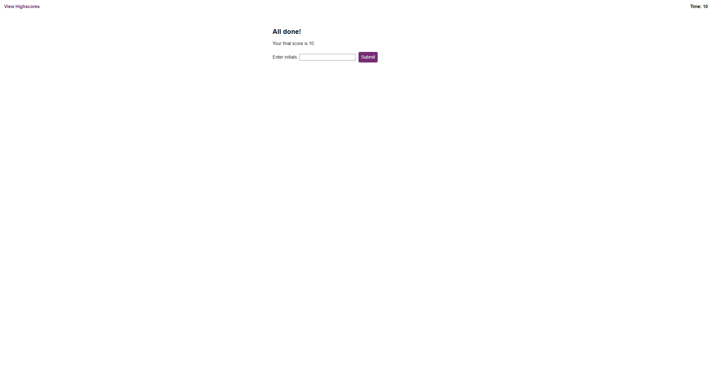

# Code Quiz

## Description
1. Clicking the start button presents you with a question and the timer begins
2. The user is presented with a new question after clicking on an answer
3. Answering a question incorrectly penalizes the timer
4. The game is over once the timer reaches 0
5. When the game is over, the user has the ability to save initials and score

## Mock Up

## Screenshots

## Links
[Application Link - Open in a new tab](https://jpascual007.github.io/EDX-homework04/)
